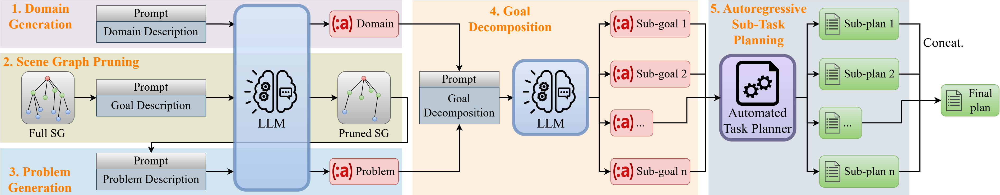

# DELTA: Decomposed Efficient Long-Term Robot Task Planning using Large Language Models

This repository is the python implementation for the paper [DELTA: Decomposed Efficient Long-Term Robot Task Planning using Large Language Models](https://arxiv.org/abs/2404.03275), which is accepted at IEEE International Conference on Robotics & Automation (ICRA) 2025.

DELTA uses pre-trained LLMs (GPT and Llama families) to automatically:

- Generate a PDDL domain file given a natural language description of the domain knowledge
- Prune the 3D Scene Graph (3DSG) by only keeping the task-relevant items
- Generate a PDDL problem file given a natural language description of the task goal and a 3DSG representing the environment
- Decompose the long-term task goal into a sequence of sub-goals, such that an automated task planner can solve the corresponding sub-problems more efficiently

The code is implemented in Python 3.8.17.

Project webpage: https://delta-llm.github.io/



## Usage from source

#### Create a virtual environment

Assuming you have already installed Anaconda, run the following command to create a conda environment with Python 3.8:

```
conda create -n delta python=3.8
```

#### Access to the LLMs

The code inferences the GPT models via [Azure OpenAI Service](https://learn.microsoft.com/en-us/azure/ai-services/openai/). For using the Azure OpenAI API, please first apply for the access, then obtain the end point and API key from [Azure OpenAI Studio](https://oai.azure.com/portal). Create a `.env` file in the root folder and place the your key and end point there:

```
AZURE_API_KEY = "YOUR_AZURE_API_KEY"
AZURE_ENDPOINT = "https://YOUR_AZURE_ENDPOINT.openai.azure.com/"
```

If your wish to use the regular [OpenAI API](https://platform.openai.com/docs/api-reference/introduction), please adjust the corresponding part in the `__init()__` function of the `GPT` class in file `llm.py`.

To use the Llama models, create a Hugging Face account and getting access to [Hugging Face Llama 3.1 repository](https://huggingface.co/collections/meta-llama/llama-31-669fc079a0c406a149a5738f). Generate [access tokens](https://huggingface.co/settings/tokens) and use it to log in to your Hugging Face account:

```
pip install -U "huggingface_hub[cli]"
huggingface-cli login --token YOUR_HF_TOKEN
```

By default the models weights will be downloaded and stored in `~/.cache/huggingface/`. If you wish to store the models weights in a different directory, please execute the following command:

```
export HF_HOME=/YOUR_DESIRED_DIR/
```

#### Installing dependencies

First execute `pip install -r requirements.txt` to install the required packages.

Clone the [PDDLGym Planners](https://github.com/ronuchit/pddlgym_planners) repository and install from source.

```
pip install -e .
```

Install the PDDL validator [VAL](https://github.com/KCL-Planning/VAL) with the following commands (reference [here](https://github.com/KCL-Planning/VAL/issues/55)):

```
git clone https://github.com/KCL-Planning/VAL.git
VAL/scripts/linux/build_linux64.sh all Release
sudo tar -xzvf VAL/build/linux64/Release/Val--Linux.tar.gz -C /usr/local --strip-components=1
```

#### Running experiments of DELTA

For reproducing the results of DELTA with all evaluation domains, please run the bash script:

```
bash scripts/run_delta.sh
```

You may also directly run the source file of DELTA `python delta.py -h` with the `-h` flag to see more options for specifying the experiments, LLMs, domains, problems, and other parameters.

#### Running experiments of other baselines

The scripts for evaluating other baselines can also be found in the `/scripts` folder. You can find the source files of the baselines in the `/baselines` folder.

#### Evaluation results

After running the experiments, the log files are saved in the `/result` folder. Execute the following command to print the evaluation results (replace `YOUR_LOG_PATH` with the desired path of the log files):

```
python eval.py -f result/YOUR_LOG_PATH/log.csv
```

## Maintainers and Contributors

Current maintainer: [Yuchen Liu](yuchen.liu2@de.bosch.com)

Contributor: [Luigi Palmieri](luigi.palmieri@de.bosch.com)

## 3rd Party Licenses

This package depends on an open-source dataset and several open-source software. Following a list of the external dataset and software libraries:

[3DSceneGraph](https://github.com/StanfordVL/3DSceneGraph)
[LLM-GenPlan](https://github.com/tomsilver/llm-genplan)

## Citation

```
@article{liu2024delta,
  title={Delta: Decomposed efficient long-term robot task planning using large language models},
  author={Liu, Yuchen and Palmieri, Luigi and Koch, Sebastian and Georgievski, Ilche and Aiello, Marco},
  journal={arXiv preprint arXiv:2404.03275},
  year={2024}
}
```
